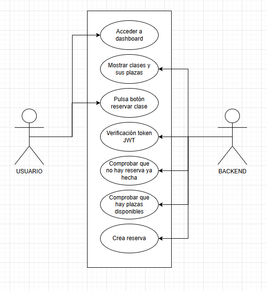

# ProjectSENSEI

Aplicación para la gestión de clases y reservas. Permite a los usuarios registrarse, reservar actividades y cancelar su reserva, mientras que el administrador puede crear, editar y eliminar clases, además de llevar el control de asistencia.

---

## Tecnologías

**Frontend**
- Vue
- Vue Router
- Pinia
- Axios

**Backend**
- Node.js + Express
- MongoDB (Atlas)
- JWT (jsonwebtoken)
- bcryptjs
- Zod

---

## Estructura del proyecto

```
APP/
├── SenseiAPI/                  # Backend (Node.js + Express)
│   ├── config/
│   │   └── db.js               # Conexión a MongoDB
│   ├── middlewares/
│   │   ├── auth.js             # Verificación JWT
│   │   ├── admin.js            # Verificación de rol admin
│   │   └── validate.js         # Validación Zod
│   ├── routes/
│   │   ├── auth.js             # Registro y login
│   │   ├── clases.js           # CRUD de clases
│   │   └── reservas.js         # Gestión de reservas
│   ├── schemas/
│   │   └── index.js            # Esquemas de validación Zod
│   ├── utils/
│   │   └── createAdmin.js      # Creación automática del admin
│   ├── .env                    # Variables de entorno
│   └── server.js               # Punto de entrada
│
└── ProjectSENSEI/                # Frontend (Vue)
    ├── src/
    │   ├── assets/
    │   ├── components/
    │   │   └── UserLayout.vue  # Layout con sidebar para usuarios
    │   ├── views/
    │   │   ├── LoginView.vue
    │   │   ├── RegisterView.vue
    │   │   ├── DashboardView.vue
    │   │   ├── MyReservationsView.vue
    │   │   └── AdminView.vue
    │   ├── stores/
    │   │   └── userStore.js    # Estado global con Pinia
    │   ├── services/
    │   │   └── api.js          # Instancia de Axios
    │   ├── router/
    │   │   └── index.js        # Rutas de navegación
    │   ├── App.vue
    │   └── main.js
```

---

## Instalación y uso

### Requisitos

- Nodejs
- Cuenta en MongoDB Atlas (o MongoDB local)

### Backend

```bash
cd SenseiAPI
npm install
```

Crea un archivo `.env` en `SenseiAPI/` con el siguiente contenido:

```env
MONGO_URI=tu_uri_de_mongodb
DB_NAME=nombre_de_tu_bbdd
PORT=3000
JWT_SECRET=tu_secreto_jwt
ADMIN_USERNAME=tu_usuario_admin
ADMIN_PASSWORD=tu_contraseña_admin
```

Inicia el servidor:

```bash
node server.js
```

### Frontend

```bash
cd ProjectSENSEI
npm install
npm run dev
```

La app estará disponible en `http://localhost:5173`. También puedes iniciarla con electron usando:

```bash
npm run electron:dev
```

---

## Diagrama de casos de uso



---

## Funcionalidades

### Usuario
- Registro e inicio de sesión
- Ver clases disponibles con plazas en tiempo real
- Reservar una clase
- Cancelar una reserva
- Ver sus reservas activas en "Mis reservas"

### Regla de cancelación tardía
Si un usuario cancela su reserva con **15 minutos o menos** de antelación al inicio de la clase, la cancelación queda registrada como **no asistencia**. La reserva no se elimina sino que se bloquea: el usuario ve el botón como "Cancelada" y no puede modificarla.

### Administrador
- Crear, editar y eliminar clases
- Ver la lista de asistentes por clase
- Marcar asistencia de cada usuario
- Las reservas con cancelación tardía aparecen bloqueadas (no editable)

---

## Autenticación y seguridad

- Las contraseñas se hashean con **bcryptjs** antes de guardarse en la base de datos
- La autenticación se basa en **JWT**
- El token se almacena en `sessionStorage`, por lo que se elimina al cerrar o recargar la página
- Las rutas protegidas verifican el token en cada petición mediante un middleware
- Las rutas de administrador verifican adicionalmente que el rol sea `admin`
- Los datos de entrada se validan con **Zod** antes de llegar a la lógica de negocio

---

## Variables de entorno

| Variable | Descripción |
|---|---|
| `MONGO_URI` | URI de conexión a MongoDB Atlas |
| `DB_NAME` | Nombre de la base de datos |
| `PORT` | Puerto del servidor (por defecto 3000) |
| `JWT_SECRET` | Clave secreta para los tokens JWT |
| `ADMIN_USERNAME` | Usuario del administrador |
| `ADMIN_PASSWORD` | Contraseña del administrador |

---

## API — Endpoints principales

### Auth
| Método | Ruta | Descripción |
|---|---|---|
| POST | `/api/auth/register` | Registro de usuario |
| POST | `/api/auth/login` | Login, devuelve JWT |

### Clases
| Método | Ruta | Acceso | Descripción |
|---|---|---|---|
| GET | `/api/clases` | Usuario | Lista todas las clases |
| POST | `/api/clases` | Admin | Crear clase |
| PUT | `/api/clases/:id` | Admin | Editar clase |
| DELETE | `/api/clases/:id` | Admin | Eliminar clase |

### Reservas
| Método | Ruta | Acceso | Descripción |
|---|---|---|---|
| POST | `/api/reservas` | Usuario | Crear reserva |
| GET | `/api/reservas/my` | Usuario | Ver mis reservas |
| DELETE | `/api/reservas/:id` | Usuario | Cancelar reserva |
| GET | `/api/reservas/class/:classId` | Admin | Ver asistentes de una clase |
| PUT | `/api/reservas/:id/attendance` | Admin | Marcar asistencia |
